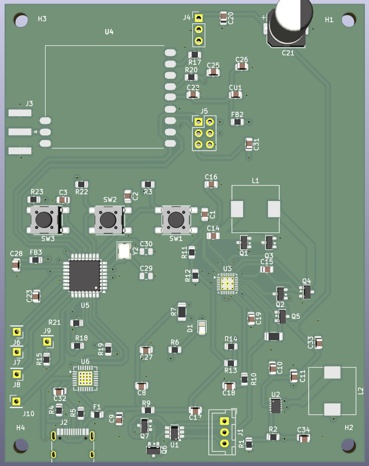
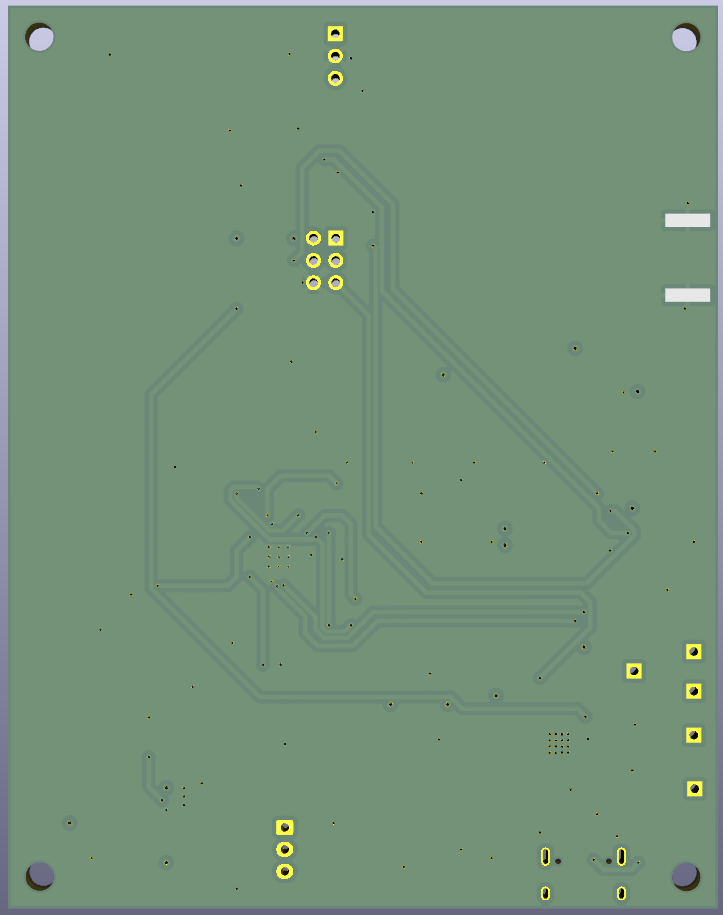
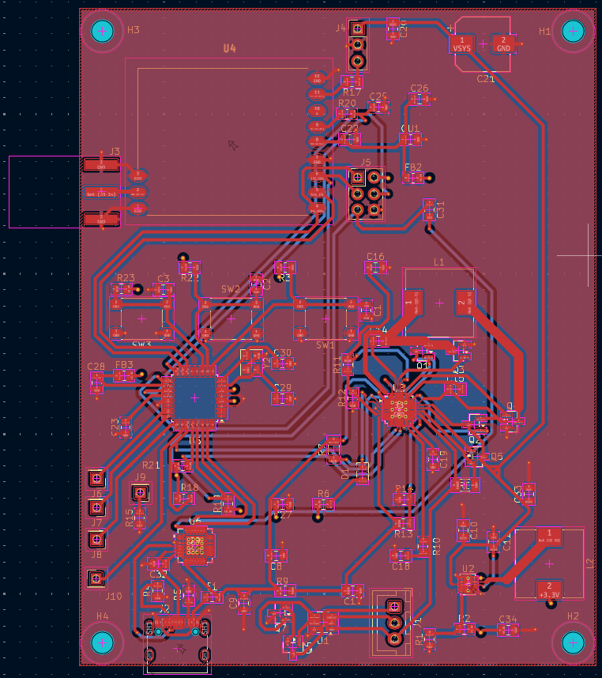
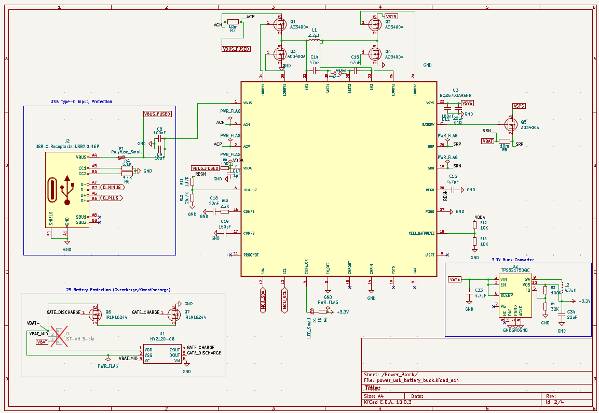
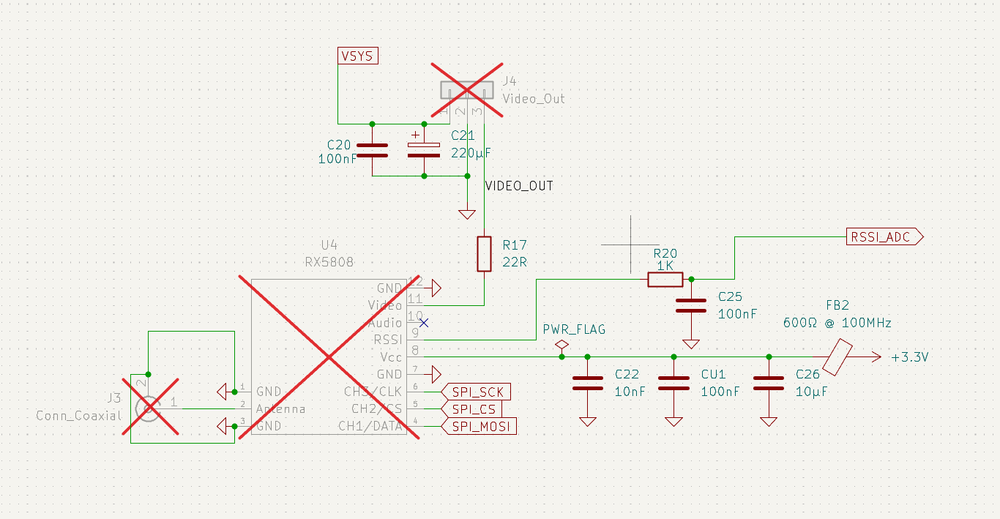
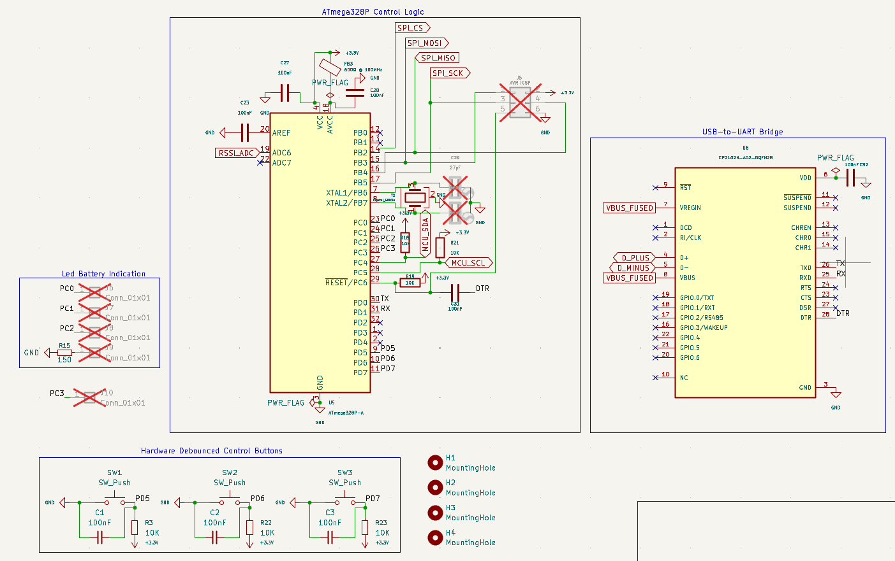
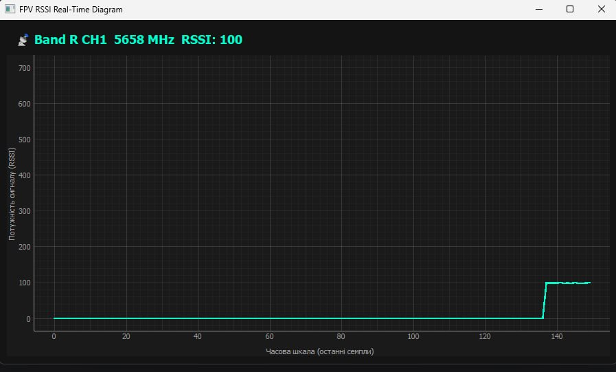
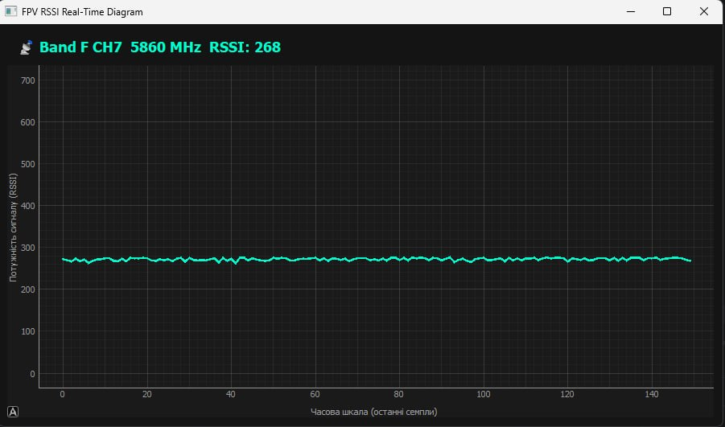
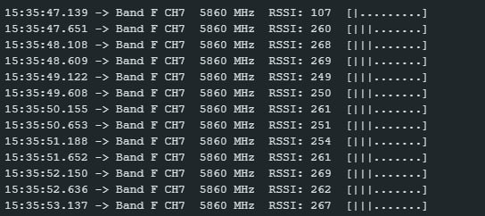

# Smart FPV Analog RX & Spectral Analyzer

Апаратно-програмний комплекс для прийому та аналізу аналогового FPV-відеосигналу в діапазоні 5.8 GHz. Проєкт поєднує 4-шарову друковану плату, RF-модуль RX5808, мікроконтролер ATmega328P, систему живлення та Python-інтерфейс для моніторингу RSSI в реальному часі.

Плата спроєктована в KiCad і замовлена через JLCPCB. На момент підготовки репозиторію плата ще не доставлена, тому в репозиторії подані проєктні матеріали: схема, PCB-layout, production-файли, 3D-рендери та скріншоти програмної частини.

## Основні можливості

- прийом аналогового FPV-сигналу 5.8 GHz через RX5808;
- перемикання FPV-частот через SPI-керування RX5808;
- зчитування RSSI для оцінки рівня сигналу;
- виведення band, channel, frequency та RSSI через serial log;
- візуалізація RSSI в desktop analyzer у реальному часі;
- підготовлена 4-шарова PCB з окремими RF, MCU та power-management блоками;
- production package для виготовлення плати.

## Hardware

- RX5808 5.8 GHz FPV receiver module;
- ATmega328P microcontroller;
- BQ25703A power-management controller;
- HY2120-CB battery protection IC;
- CP2102N USB-to-UART bridge;
- USB Type-C;
- SMA edge-mount antenna connector.

## PCB

Плата розроблена як 4-шарова PCB з розділенням критичних вузлів:

- RF-блок із RX5808 та SMA-роз'ємом;
- MCU-блок на ATmega328P;
- power-management блок із BQ25703A;
- USB/UART-блок для підключення до комп'ютера;
- окреме трасування для силових та сигнальних ліній;
- GND-полігони для зменшення шумів і покращення стабільності аналогових вимірювань.

У репозиторії є KiCad-файли, BOM, component positions, designators, IPC netlist і production archive.

## Firmware

Прошивка для ATmega328P реалізує:

- SPI-керування RX5808;
- вибір FPV-частоти;
- зчитування RSSI через ADC;
- I2C-взаємодію з power-management контролером;
- serial logging для перевірки каналу, частоти та RSSI.

Файл прошивки:

- `CODE/fpv_receiver.ino`

## Desktop analyzer

Python-додаток використовується для перегляду RSSI в реальному часі. Він дає змогу візуально порівнювати рівень сигналу на різних каналах і бачити стабільність прийому.

Використані технології:

- Python;
- PyQt5;
- pyqtgraph;
- pyserial;
- NumPy.

Файл додатку:

- `CODE/main.py`

## Структура репозиторію

```text
.
├── CODE/                         # firmware and desktop analyzer
│   ├── fpv_receiver.ino
│   └── main.py
├── IMAGES/                       # renders, schematics and analyzer screenshots
├── Custom_Libs/                  # custom KiCad symbols and footprints
├── production/                   # BOM, positions, designators, netlist
├── atmega328.kicad_pcb           # PCB layout
├── atmega328.kicad_sch           # main schematic
├── mcu_atmega_spi.kicad_sch      # MCU/SPI schematic block
├── rx5808_rf.kicad_sch           # RF schematic block
├── power_usb_battery_buck.kicad_sch
└── production.zip
```

## Візуальні матеріали

### PCB та схема













### RSSI analyzer







## Production files

Папка `production/` містить матеріали для виготовлення та перевірки плати:

- `bom.csv`;
- `positions.csv`;
- `designators.csv`;
- `netlist.ipc`;
- `atmega328.zip`.

Також у корені є `production.zip` як готовий архів production package.

## Поточний статус

- schematic design completed;
- 4-layer PCB layout completed;
- production files generated;
- PCB ordered through JLCPCB;
- firmware and desktop analyzer added to the repository;
- RSSI analyzer screenshots included.
